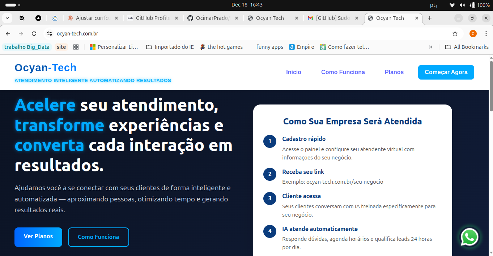
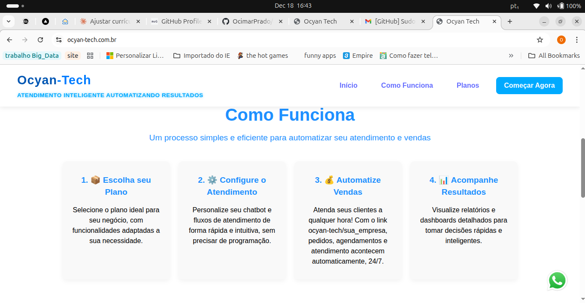
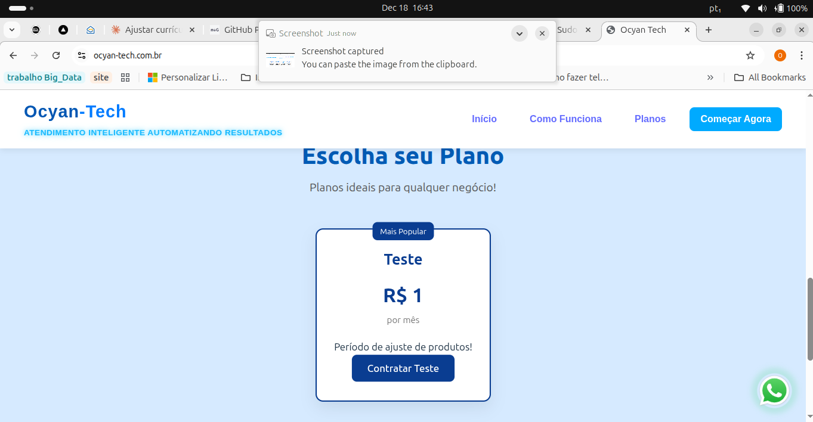
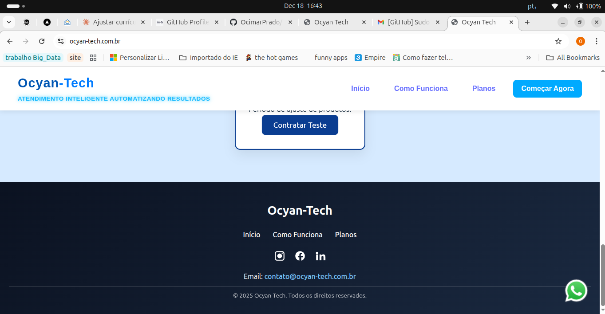

## Frontend Project A – Personal Project

Web frontend application developed as a personal project, focused on React, TypeScript, and frontend development best practices.
The project serves as a real foundation for web systems, institutional websites, and administrative dashboards.

**Keywords (ATS / SEO)**

Frontend Developer, React Developer, TypeScript, Web Development, Single Page Application (SPA), Component-Based Architecture, Responsive Design, UI Development, JavaScript, HTML5, CSS3, Git

## Project Objective

Consolidate knowledge in React and TypeScript

Apply componentization, strong typing, and clean code organization

Create a scalable base for real-world web applications

Serve as a professional portfolio project

Technologies Used

React

TypeScript

JavaScript (ES6+)

HTML5

CSS3

Node.js

Vite

Git / GitHub

Implemented Features

Modular, component-based structure

Organization by pages, services, and interfaces

Strong typing with TypeScript

Responsive layout

Code prepared for REST API integration

Base structure ready for authentication and future expansion

## Project Structure
src/
 ├─ components/
 ├─ pages/
 ├─ services/
 ├─ interfaces/
 ├─ styles/
 ├─ assets/
 ├─ App.tsx
 └─ main.tsx

**How to Run Locally**
git clone https://github.com/OcimarPrado/Frontend-ProjetoA.git
cd Frontend-ProjetoA
npm install
npm run dev

Access: http://localhost:5173

Project Status

Personal project under continuous development.

Upcoming Improvements

UI/UX enhancements

Backend integration (REST API)

User authentication

Production deployment

Automated tests

## Demonstração Visual / Visual Demo

## 📸 Demonstração Visual / Visual Demo

| Desktop Version | Mobile Experience |
|---|---|
|  | |
|  | |
|  | |
|  | |

> 🔐 **Restricted Access:** For security reasons and because this is a production-ready product, the deployment environment is password-protected. The images above serve as a demonstration of the interface and the features developed.

## Author

Ocimar Prado

Frontend Developer | React | TypeScript

## GitHub: https://github.com/OcimarPrado

## LinkedIn: https://linkedin.com/in/onprado

## Email: onprado39@gmail.com

**License**

Personal project for professional and portfolio purposes.
